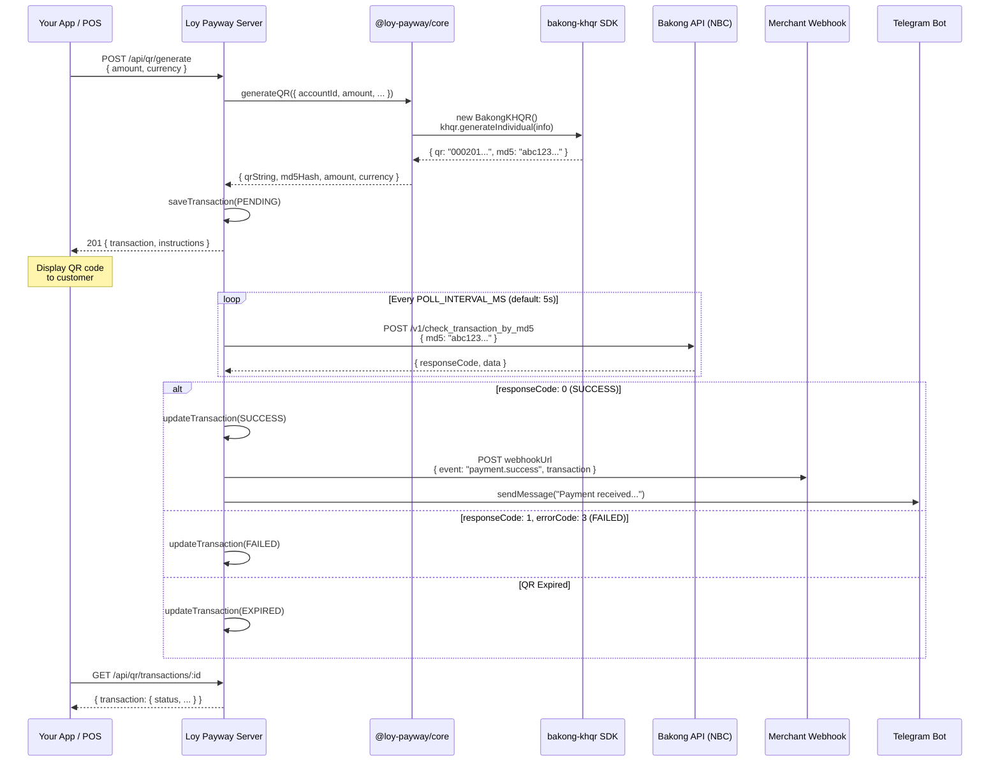
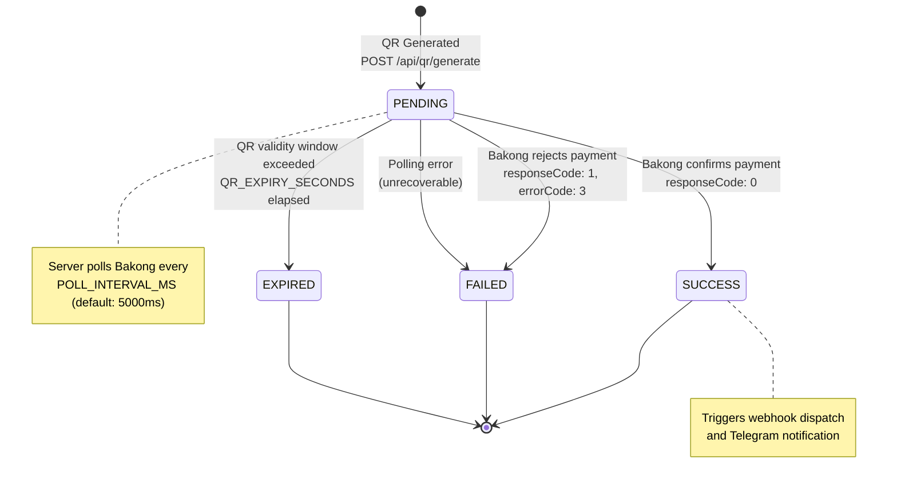

# Bakong & KHQR Integration Guide

> **Loy Payway** — Open-source KHQR payment middleware for Cambodia's Bakong ecosystem.

This guide explains how Loy Payway integrates with **Bakong**, Cambodia's national interbank payment system, and the **KHQR** QR code standard. It is written for international developers who may be encountering Cambodia's payment infrastructure for the first time.

---

## Table of Contents

- [What Is KHQR and the Bakong Ecosystem?](#what-is-khqr-and-the-bakong-ecosystem)
- [Architecture Overview](#architecture-overview)
- [Account ID Format and Supported Banks](#account-id-format-and-supported-banks)
- [QR Types: Individual vs. Merchant](#qr-types-individual-vs-merchant)
- [Transaction Lifecycle](#transaction-lifecycle)
- [Demo Mode vs. Live Mode](#demo-mode-vs-live-mode)
- [Getting Started with Bakong](#getting-started-with-bakong)
- [Environment Variable Reference](#environment-variable-reference)
- [Currency Handling: USD vs. KHR](#currency-handling-usd-vs-khr)
- [Troubleshooting](#troubleshooting)

---

## What Is KHQR and the Bakong Ecosystem?

### Bakong

**Bakong** is Cambodia's national digital payment system, operated by the **National Bank of Cambodia (NBC)**. Launched in 2020, it serves as the country's real-time interbank settlement layer — similar in spirit to India's UPI or Brazil's PIX.

Key facts:

- Connects **all major Cambodian banks** into a single, interoperable network
- Supports instant transfers in both **USD** and **KHR** (Cambodian Riel)
- Provides an **Open API** for merchants and developers to verify payments programmatically
- Used by millions of Cambodians for everyday payments — from street vendors to large retailers

### KHQR

**KHQR** (Khmer QR) is the standardized QR code format that rides on top of Bakong. Think of it as Cambodia's national QR payment standard.

- **Based on the EMVCo QR specification** — the same global standard behind QR payments in Singapore (SGQR), Thailand (PromptPay), and India (BharatQR)
- **Issued and maintained by NBC**, ensuring every bank uses the same format
- **Universally accepted** — any KHQR code can be scanned by ABA, ACLEDA, Wing, Bakong app, TrueMoney, Canadia Bank, and dozens of other banking apps
- Every valid KHQR string starts with `000201` (the EMVCo header) and ends with a CRC-16 checksum in the format `6304XXXX`

### Where Loy Payway Fits

Loy Payway is middleware that sits between your application and the Bakong network:

```
┌─────────────┐     ┌──────────────┐     ┌──────────────┐
│  Your App   │────▶│  Loy Payway  │────▶│  Bakong API  │
│  (Client)   │◀────│  (Middleware) │◀────│  (NBC)       │
└─────────────┘     └──────────────┘     └──────────────┘
```

It handles QR generation, payment status polling, webhook dispatch, and Telegram notifications — so you don't have to build that plumbing yourself.

---

## Architecture Overview

The following sequence diagram shows the complete payment flow, from QR generation to webhook delivery:



### Component Responsibilities

| Component | Package | Role |
|---|---|---|
| **QR Generator** | `@loy-payway/core` → `qr.js` | Wraps the `bakong-khqr` SDK to produce KHQR-compliant QR strings |
| **Poller** | `@loy-payway/core` → `poller.js` | Background loop that checks Bakong API for payment confirmation |
| **Dispatcher** | `@loy-payway/core` → `dispatcher.js` | Sends webhooks (with HMAC signature) and Telegram notifications |
| **Token Manager** | `@loy-payway/core` → `token.js` | Manages the Bakong bearer token, with demo fallback |
| **API Server** | `@loy-payway/server` | Express routes, authentication, transaction storage |

---

## Account ID Format and Supported Banks

Every Bakong account is identified by an **Account ID** in the format:

```
<username>@<bank_code>
```

For example: `sunrise_coffee@aclb` means the account `sunrise_coffee` at **ACLEDA Bank**.

### Supported Bank Codes

The following table lists common Bakong-participating bank codes. The full list of participating institutions is maintained by NBC and grows as more banks join the network.

| Bank Code | Bank Name | Notes |
|---|---|---|
| `@aclb` | ACLEDA Bank | Largest bank in Cambodia |
| `@aba` | ABA Bank (Advanced Bank of Asia) | Popular with expats and digital users |
| `@wing` | Wing (Cambodia) | Widespread mobile money service |
| `@trmc` | TrueMoney Cambodia | Mobile wallet provider |
| `@ppcb` | Phnom Penh Commercial Bank | Major commercial bank |
| `@ftbk` | Foreign Trade Bank of Cambodia | Government-affiliated bank |
| `@cpbk` | Canadia Bank | One of the largest private banks |

> [!TIP]
> The bank code is **case-insensitive** in most contexts, but we recommend using lowercase to match the convention used by the Bakong KHQR SDK.

### Account ID in Loy Payway

When registering a merchant, the `accountId` is stored and used for all subsequent QR code generation:

```bash
curl -X POST http://localhost:3000/api/merchant/register \
  -H "Content-Type: application/json" \
  -d '{
    "name": "Sunrise Coffee",
    "accountId": "sunrise_coffee@aclb"
  }'
```

The `accountId` determines which Bakong wallet receives funds when a customer scans the QR code.

---

## QR Types: Individual vs. Merchant

The KHQR standard defines two QR structures, corresponding to two EMVCo tag ranges. Loy Payway supports both.

### Individual QR (Tag 29) — Default

**What it is:** A personal or small-business QR code. This is the most common type and is the default in Loy Payway.

**When to use it:**

- Solo merchants, freelancers, small shops
- Any case where you have a direct Bakong account ID
- Quick setup — no acquiring bank relationship needed

**How it works in code:**

```javascript
const { generateQR } = require("@loy-payway/core");

const result = await generateQR({
  accountId: "sunrise_coffee@aclb",
  merchantName: "Sunrise Coffee",
  amount: 4.50,
  currency: "USD",
});
// result.qrString → "000201...6304XXXX"
// result.md5Hash  → "a1b2c3..."
```

**SDK call:** `khqr.generateIndividual(new IndividualInfo(...))`

### Merchant QR (Tag 30) — Corporate

**What it is:** A corporate merchant QR that includes an **acquiring bank** identifier and a **merchant ID** assigned by that bank. This is used by larger businesses that have formal merchant agreements with a bank.

**When to use it:**

- Businesses with a formal merchant acquiring agreement
- When the acquiring bank requires Tag 30 for reconciliation
- Multi-branch retailers who need a merchant ID for settlement

**How it works in code:**

```javascript
const result = await generateQR({
  accountId: "sunrise_corp@aclb",
  merchantName: "Sunrise Corp",
  amount: 25.00,
  currency: "USD",
  merchantType: "merchant",        // switches to Tag 30
  acquiringBank: "ACLEDA Bank",    // required for merchant type
  merchantId: "MCH-00123",         // required for merchant type
});
```

**SDK call:** `khqr.generateMerchant(new MerchantInfo(...))`

### Comparison

| Feature | Individual (Tag 29) | Merchant (Tag 30) |
|---|---|---|
| **Use case** | Personal, small business | Corporate, formal acquiring |
| **Required fields** | `accountId`, `amount` | `accountId`, `amount`, `acquiringBank`, `merchantId` |
| **Bank relationship** | Direct account only | Merchant acquiring agreement |
| **Setup complexity** | Low | Medium |
| **Default in Loy Payway** | ✅ Yes | No |

> [!NOTE]
> Both QR types produce valid KHQR strings scannable by all Cambodian banking apps. The difference is in the metadata embedded within the QR, which affects how the receiving bank processes the transaction.

---

## Transaction Lifecycle

Every payment in Loy Payway follows a deterministic state machine. The diagram below shows all possible state transitions:



### States Explained

| Status | Meaning | What Happens Next |
|---|---|---|
| **PENDING** | QR has been generated and the server is actively polling Bakong for payment confirmation. | Polling continues every `POLL_INTERVAL_MS` until resolution or expiry. |
| **SUCCESS** | Bakong confirmed that the customer paid. The response includes `fromAccountId`, `amount`, `currency`, and a blockchain `hash`. | Webhook is sent to the merchant's `webhookUrl`. Telegram notification is sent if `telegramChatId` is configured. |
| **FAILED** | Bakong explicitly rejected the transaction (`responseCode: 1, errorCode: 3`), or an unrecoverable polling error occurred. | Terminal state. The merchant should prompt the customer to retry. |
| **EXPIRED** | The QR code's validity window (`QR_EXPIRY_SECONDS`) elapsed without a payment being detected. | Terminal state. A new QR must be generated for the customer. |

### Bakong API Response Mapping

The poller translates raw Bakong API responses into Loy Payway's status model:

```javascript
// Bakong response → Loy Payway status
{ responseCode: 0 }                    → "SUCCESS"
{ responseCode: 1, errorCode: 3 }      → "FAILED"
{ responseCode: 1 }                    → "PENDING"  (keep polling)
```

### Success Response Data

When a transaction succeeds, the Bakong API returns rich payment details:

```json
{
  "responseCode": 0,
  "responseMessage": "Success",
  "data": {
    "hash": "a8f3e2b1c4d5...",
    "fromAccountId": "customer_name@aba",
    "toAccountId": "sunrise_coffee@aclb",
    "amount": 4.50,
    "currency": "USD",
    "description": "Payment"
  }
}
```

---

## Demo Mode vs. Live Mode

Loy Payway ships with a **demo mode** that simulates the entire Bakong payment flow locally, making it possible to develop and test without real banking credentials.

### Comparison

| Feature | Demo Mode | Live Mode |
|---|---|---|
| **Activation** | `PAYWAY_ALLOW_DEMO=true` (default) or `BAKONG_BEARER_TOKEN` not set | `PAYWAY_ALLOW_DEMO=false` **and** `BAKONG_BEARER_TOKEN` is set |
| **Bakong API calls** | None — fully simulated | Real HTTPS calls to `api-bakong.nbc.gov.kh` |
| **QR codes** | Valid KHQR format (generated by SDK) | Valid KHQR format (generated by SDK) |
| **Payment confirmation** | Auto-confirms after ~3 seconds | Confirmed when real payment is detected |
| **Payer identity** | `demo-customer@bakong` | Actual customer's Bakong account |
| **Expiry behavior** | Respects `QR_EXPIRY_SECONDS` | Respects `QR_EXPIRY_SECONDS` |
| **Webhooks** | Dispatched normally | Dispatched normally |
| **Telegram alerts** | Sent if configured | Sent if configured |
| **Use case** | Local development, CI/CD, demos | Production, staging with real bank |

### How Demo Mode Works Internally

When demo mode is active, the poller creates an in-memory Bakong client stub instead of connecting to the real API:

```javascript
// From @loy-payway/core → poller.js
if (demoEnabled || !process.env.BAKONG_BEARER_TOKEN) {
  return {
    async checkTransactionByMd5(md5Hash, transaction) {
      const age = Date.now() - new Date(transaction.createdAt).getTime();
      // Auto-confirm after 3 seconds
      if (transaction.demoAutoConfirm && age >= 3000) {
        return {
          status: "SUCCESS",
          amount: transaction.amount,
          currency: transaction.currency,
          fromAccountId: "demo-customer@bakong",
          confirmedAt: new Date().toISOString(),
        };
      }
      // Expire if past QR validity window
      if (age >= DEFAULT_EXPIRY_MS) {
        return { status: "EXPIRED" };
      }
      return { status: "PENDING", md5Hash };
    },
  };
}
```

> [!IMPORTANT]
> The QR strings generated in demo mode are **real, valid KHQR payloads** produced by the official `bakong-khqr` SDK. The only difference is that no one is checking the Bakong network for actual payments — the confirmation is simulated.

### Switching from Demo to Live

```bash
# .env
PAYWAY_ALLOW_DEMO=false
BAKONG_BEARER_TOKEN=eyJhbGciOiJIUzI1NiIs...
```

No code changes are required. The poller automatically switches to real Bakong API calls when both conditions are met.

---

## Getting Started with Bakong

To use Loy Payway in production with real payments, you need a **Bakong API Bearer Token**.

### Step 1: Create a Bakong Account

If you don't already have one, download the **Bakong app** from the [App Store](https://apps.apple.com/app/bakong/id1483978928) or [Google Play](https://play.google.com/store/apps/details?id=kh.gov.nbc.bakong_app) and register with a Cambodian phone number.

### Step 2: Access the Bakong Open API Portal

Visit the **Bakong Open API** developer portal to register for API access. You will need:

- A valid Bakong account (individual or merchant)
- Business registration documents (for merchant accounts)
- Contact information for the designated technical lead

### Step 3: Generate an API Token

Once approved, you can generate a **JWT Bearer Token** from the portal. This token:

- Authenticates your server to the Bakong API
- Has an expiration date (check the `exp` claim in the JWT)
- Should be rotated before expiry

### Step 4: Configure Loy Payway

Add your token to the `.env` file:

```bash
# Disable demo mode
PAYWAY_ALLOW_DEMO=false

# Your Bakong API credentials
BAKONG_BEARER_TOKEN=eyJhbGciOiJIUzI1NiIs...
BAKONG_ACCOUNT_ID=your_business@aclb

# Optional: customize the API base URL (rarely needed)
# BAKONG_API_BASE=https://api-bakong.nbc.gov.kh
```

### Step 5: Verify Your Setup

Generate a test QR and scan it with a Bakong-connected banking app:

```bash
# Register your merchant
curl -X POST http://localhost:3000/api/merchant/register \
  -H "Content-Type: application/json" \
  -d '{
    "name": "My Business",
    "accountId": "my_business@aclb"
  }'

# Generate a small-amount test QR
curl -X POST http://localhost:3000/api/qr/generate \
  -H "Authorization: Bearer <your-merchant-api-key>" \
  -H "Content-Type: application/json" \
  -d '{ "amount": 0.01, "currency": "USD" }'
```

> [!CAUTION]
> The `BAKONG_BEARER_TOKEN` is a sensitive credential. Never commit it to version control. Always use environment variables or a secrets manager.

---

## Environment Variable Reference

All Bakong-related configuration is managed through environment variables. Copy `.env.example` to `.env` and adjust as needed.

### Core Bakong Settings

| Variable | Required | Default | Description |
|---|---|---|---|
| `BAKONG_API_BASE` | No | `https://api-bakong.nbc.gov.kh` | Base URL for the Bakong Open API. Override only for custom proxy setups. |
| `BAKONG_BEARER_TOKEN` | For live mode | — | JWT token issued by NBC for Bakong API authentication. Required when `PAYWAY_ALLOW_DEMO=false`. |
| `BAKONG_ACCOUNT_ID` | No | — | Default Bakong account ID used by the demo seed merchant (e.g., `012345678@aclb`). |

### Behavior Settings

| Variable | Required | Default | Description |
|---|---|---|---|
| `PAYWAY_ALLOW_DEMO` | No | `true` | Set to `false` to disable demo mode and require a real `BAKONG_BEARER_TOKEN`. Any value other than `"false"` enables demo mode. |
| `POLL_INTERVAL_MS` | No | `5000` | How often (in milliseconds) the server checks Bakong for payment confirmation. Lower values mean faster detection but more API calls. |
| `QR_EXPIRY_SECONDS` | No | `600` | How long a QR code remains valid (in seconds). After this window, the transaction is marked `EXPIRED`. Default is 10 minutes. |

### Notification Settings

| Variable | Required | Default | Description |
|---|---|---|---|
| `TELEGRAM_BOT_TOKEN` | No | — | Telegram Bot API token for sending payment notifications. |
| `TELEGRAM_CHAT_ID` | No | — | Telegram chat/group ID to receive payment alerts. |

### Example `.env` for Development

```bash
# Demo mode — no real Bakong calls
PAYWAY_ALLOW_DEMO=true
BAKONG_ACCOUNT_ID=demo_merchant@aclb
POLL_INTERVAL_MS=5000
QR_EXPIRY_SECONDS=600
PORT=3000
```

### Example `.env` for Production

```bash
# Live Bakong integration
PAYWAY_ALLOW_DEMO=false
BAKONG_BEARER_TOKEN=eyJhbGciOiJIUzI1NiIs...
BAKONG_API_BASE=https://api-bakong.nbc.gov.kh
BAKONG_ACCOUNT_ID=my_business@aclb
POLL_INTERVAL_MS=5000
QR_EXPIRY_SECONDS=600
PORT=3000

# Notifications
TELEGRAM_BOT_TOKEN=123456:ABC-DEF...
TELEGRAM_CHAT_ID=987654321
```

---

## Currency Handling: USD vs. KHR

Cambodia has a unique dual-currency economy. Both **US Dollars (USD)** and **Cambodian Riel (KHR)** are in widespread daily use, and the Bakong system supports both natively.

### How It Works in KHQR

The KHQR standard uses **ISO 4217 numeric currency codes** internally:

| Currency | ISO Code | KHQR SDK Constant | Typical Use |
|---|---|---|---|
| **USD** | `840` | `khqrData.currency.usd` | Most retail and e-commerce transactions |
| **KHR** | `116` | `khqrData.currency.khr` | Government payments, local small transactions |

### Specifying Currency in Loy Payway

Pass the `currency` field when generating a QR:

```bash
# USD transaction (default)
curl -X POST http://localhost:3000/api/qr/generate \
  -H "Authorization: Bearer <api-key>" \
  -H "Content-Type: application/json" \
  -d '{ "amount": 4.50, "currency": "USD" }'

# KHR transaction
curl -X POST http://localhost:3000/api/qr/generate \
  -H "Authorization: Bearer <api-key>" \
  -H "Content-Type: application/json" \
  -d '{ "amount": 18000, "currency": "KHR" }'
```

### Amount Precision

All amounts are normalized to **two decimal places** internally, regardless of currency:

```javascript
// @loy-payway/core → qr.js
function normalizeAmount(amount) {
  const numeric = Number(amount);
  if (!Number.isFinite(numeric) || numeric <= 0) {
    throw new Error("Amount must be a positive number.");
  }
  return Number(numeric.toFixed(2));
}
```

> [!NOTE]
> While KHR transactions often use whole numbers (e.g., `4000`, `18000`), the system stores them with two decimal places for consistency. The Bakong API and SDK handle both currencies identically from a data-format perspective.

### Practical Considerations

- **Most merchants price in USD.** Cambodia's economy is heavily dollarized, especially in urban areas and tourist zones.
- **KHR is subdivided into sen** (1 KHR = 100 sen), but sen are not used in practice. KHR amounts are almost always whole numbers.
- **Exchange rate is not handled by Loy Payway.** The system passes the requested currency to the QR code as-is. Any conversion is handled by the customer's banking app at the time of payment.
- **A single merchant can accept both currencies** — just specify the desired currency per transaction.

---

## Troubleshooting

### QR Generation Issues

#### "accountId is required to generate a KHQR"

**Cause:** The merchant was registered without an `accountId`, or the value is empty.

**Fix:** Ensure the merchant has a valid Bakong account ID in the format `username@bank_code`:

```bash
curl -X POST http://localhost:3000/api/merchant/register \
  -H "Content-Type: application/json" \
  -d '{
    "name": "My Shop",
    "accountId": "my_shop@aclb"
  }'
```

#### "KHQR SDK error (code): message"

**Cause:** The `bakong-khqr` SDK rejected the input parameters. Common reasons include an invalid account ID format, unsupported currency, or missing required fields for merchant-type QR.

**Fix:** Verify that:

- `accountId` follows the `username@bank_code` format
- `currency` is either `"USD"` or `"KHR"`
- For merchant QR: both `acquiringBank` and `merchantId` are provided

#### "Amount must be a positive number"

**Cause:** The `amount` field is zero, negative, `null`, or not a valid number.

**Fix:** Always send a positive numeric value: `{ "amount": 4.50 }`

---

### Bakong API / Polling Issues

#### "BAKONG_BEARER_TOKEN is required when demo mode is disabled"

**Cause:** `PAYWAY_ALLOW_DEMO` is set to `false` but no `BAKONG_BEARER_TOKEN` is configured.

**Fix:** Either set `PAYWAY_ALLOW_DEMO=true` for development, or provide a valid token:

```bash
BAKONG_BEARER_TOKEN=eyJhbGciOiJIUzI1NiIs...
```

#### Transactions stuck in PENDING

**Possible causes:**

1. **Demo mode is off and the token is expired.** Check the JWT expiration (`exp` claim). Bakong tokens have a fixed TTL.
2. **Network connectivity.** The server cannot reach `api-bakong.nbc.gov.kh`. Check firewall and DNS settings.
3. **Customer hasn't paid yet.** The poller will continue until `QR_EXPIRY_SECONDS` elapses.

**Diagnostic steps:**

```bash
# Check if the Bakong API is reachable
curl -s -o /dev/null -w "%{http_code}" https://api-bakong.nbc.gov.kh

# Look for polling errors in the server logs
# Errors appear as: [bakong] Transaction status check failed: <message>
```

#### Transactions go straight to EXPIRED

**Cause:** `QR_EXPIRY_SECONDS` is set too low, or the system clock is out of sync.

**Fix:** Ensure `QR_EXPIRY_SECONDS` is at least `120` (2 minutes) for a reasonable payment window. The default of `600` (10 minutes) is recommended:

```bash
QR_EXPIRY_SECONDS=600
```

---

### Webhook and Notification Issues

#### Webhook not received

**Checklist:**

1. Is `webhookUrl` set on the merchant? Register or update the merchant with a valid URL.
2. Is the webhook endpoint reachable from the Loy Payway server?
3. Check the signature header — your endpoint should verify `X-PayWay-Signature` using HMAC-SHA256 with the merchant's `secretKey`:

```javascript
const crypto = require("node:crypto");

function verifySignature(secretKey, body, receivedSignature) {
  const expected = crypto
    .createHmac("sha256", secretKey)
    .update(JSON.stringify(body))
    .digest("hex");
  return expected === receivedSignature;
}
```

#### Telegram notification not sent

**Checklist:**

1. Is `TELEGRAM_BOT_TOKEN` set in `.env`?
2. Is `telegramChatId` set on the merchant (either via registration or `TELEGRAM_CHAT_ID` in the environment)?
3. Has the bot been added to the target chat/group?
4. Test the bot manually:

```bash
curl "https://api.telegram.org/bot<TOKEN>/sendMessage" \
  -d "chat_id=<CHAT_ID>&text=Test"
```

---

### Demo Mode Issues

#### Demo transactions don't auto-confirm

**Cause:** The `demoAutoConfirm` field is set to `false` in the request body.

**Fix:** Omit the field (it defaults to `true`) or set it explicitly:

```json
{ "amount": 4.50, "currency": "USD", "demoAutoConfirm": true }
```

#### Demo mode is active when it shouldn't be

**Cause:** The demo-mode check logic treats any value other than the exact string `"false"` as enabled:

```javascript
const demoEnabled = process.env.PAYWAY_ALLOW_DEMO !== "false";
```

**Fix:** Ensure the variable is set to exactly `false` (lowercase, no quotes, no whitespace):

```bash
# Correct
PAYWAY_ALLOW_DEMO=false

# These all enable demo mode (incorrect if you want live):
# PAYWAY_ALLOW_DEMO=False
# PAYWAY_ALLOW_DEMO=FALSE
# PAYWAY_ALLOW_DEMO=no
# PAYWAY_ALLOW_DEMO=0
```

---

### Quick Reference: Bakong API Endpoint

| Method | URL | Body | Auth |
|---|---|---|---|
| `POST` | `https://api-bakong.nbc.gov.kh/v1/check_transaction_by_md5` | `{ "md5": "<md5-hash>" }` | `Bearer <BAKONG_BEARER_TOKEN>` |

---

## Further Reading

- **Bakong Official Site:** [https://bakong.nbc.gov.kh](https://bakong.nbc.gov.kh)
- **EMVCo QR Specification:** [https://www.emvco.com/emv-technologies/qrcodes/](https://www.emvco.com/emv-technologies/qrcodes/)
- **bakong-khqr npm Package:** [https://www.npmjs.com/package/bakong-khqr](https://www.npmjs.com/package/bakong-khqr)
- **Loy Payway README:** [README.md](../README.md)
- **Testing Guide:** [TESTING.md](./TESTING.md)
