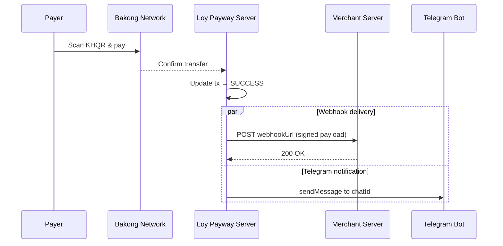

# Webhook Integration Guide

Loy Payway dispatches real-time webhook notifications to your server whenever a payment is confirmed. This guide covers everything you need to receive, verify, and handle those notifications in production.

---

## Table of Contents

- [Overview](#overview)
- [How Webhooks Work](#how-webhooks-work)
- [Setting Up Webhooks](#setting-up-webhooks)
  - [During Merchant Registration](#during-merchant-registration)
  - [Updating an Existing Merchant](#updating-an-existing-merchant)
  - [Removing a Webhook](#removing-a-webhook)
- [Webhook Payload Reference](#webhook-payload-reference)
  - [Top-Level Fields](#top-level-fields)
  - [Transaction Object](#transaction-object)
  - [Full Example Payload](#full-example-payload)
- [Signature Verification](#signature-verification)
  - [How Signing Works](#how-signing-works)
  - [Node.js](#nodejs)
  - [Python](#python)
  - [PHP](#php)
  - [Go](#go)
- [Testing with the Preview Endpoint](#testing-with-the-preview-endpoint)
  - [Default Preview](#default-preview)
  - [Custom Payload Preview](#custom-payload-preview)
  - [End-to-End Verification Test](#end-to-end-verification-test)
- [Telegram Notifications](#telegram-notifications)
  - [Setup](#telegram-setup)
  - [Message Format](#telegram-message-format)
- [Best Practices](#best-practices)
- [Troubleshooting](#troubleshooting)

---

## Overview

When a KHQR payment is confirmed on the Bakong network, Loy Payway does two things:

1. **Webhook** — sends an HTTP `POST` request to the merchant's registered `webhookUrl` with a JSON payload describing the transaction.
2. **Telegram** _(optional)_ — sends a human-readable notification to the merchant's Telegram chat.

Both channels are fire-and-forget: the server dispatches the notification immediately after the transaction status transitions to `SUCCESS`.



---

## How Webhooks Work

| Step | What happens |
|------|-------------|
| 1 | A customer scans the KHQR code and completes payment via the Bakong network. |
| 2 | Loy Payway's poller detects the confirmed transfer and updates the transaction status to `SUCCESS`. |
| 3 | The dispatcher builds a JSON payload containing the event type and full transaction details. |
| 4 | The payload is signed with **HMAC-SHA256** using the merchant's `secretKey`. |
| 5 | A `POST` request is sent to the merchant's `webhookUrl` with the JSON body and the `X-PayWay-Signature` header. |
| 6 | Your server verifies the signature, processes the event, and returns a `200` response. |

---

## Setting Up Webhooks

### During Merchant Registration

Provide your `webhookUrl` when you register:

```bash
curl -X POST http://localhost:3000/api/merchant/register \
  -H "Content-Type: application/json" \
  -d '{
    "name": "Sunrise Coffee",
    "accountId": "012345678@aclb",
    "webhookUrl": "https://example.com/payway/webhook"
  }'
```

**Response:**

```json
{
  "merchant": {
    "id": "a1b2c3d4-...",
    "apiKey": "f8c3a1...",
    "secretKey": "d94e7b...",
    "name": "Sunrise Coffee",
    "accountId": "012345678@aclb",
    "webhookUrl": "https://example.com/payway/webhook",
    "telegramChatId": null,
    "isActive": true,
    "createdAt": "2026-01-01T00:00:00.000Z"
  },
  "onboarding": {
    "apiKey": "f8c3a1...",
    "nextStep": "Use this API key as a Bearer token when calling /api/qr/generate."
  }
}
```

> [!IMPORTANT]
> Save the `secretKey` from the registration response. You will need it to verify webhook signatures. This value is generated once and cannot be retrieved again through the API.

### Updating an Existing Merchant

Use `PATCH /api/merchant/:id` to add or change the webhook URL at any time:

```bash
curl -X PATCH http://localhost:3000/api/merchant/a1b2c3d4-... \
  -H "Content-Type: application/json" \
  -d '{
    "webhookUrl": "https://new-endpoint.example.com/hooks/payway"
  }'
```

### Removing a Webhook

To stop receiving webhooks, set `webhookUrl` to an empty string:

```bash
curl -X PATCH http://localhost:3000/api/merchant/a1b2c3d4-... \
  -H "Content-Type: application/json" \
  -d '{
    "webhookUrl": ""
  }'
```

This sets `webhookUrl` to `null` internally and no further notifications will be dispatched.

---

## Webhook Payload Reference

### Top-Level Fields

| Field | Type | Description |
|-------|------|-------------|
| `event` | `string` | Event type. Currently always `"payment.success"`. |
| `merchantId` | `string` (UUID) | The merchant who owns this transaction. |
| `transaction` | `object` | Full transaction details. See below. |

### Transaction Object

| Field | Type | Description |
|-------|------|-------------|
| `id` | `string` (UUID) | Unique transaction identifier. |
| `merchantId` | `string` (UUID) | Same as the top-level `merchantId`. |
| `status` | `string` | Transaction status — `"SUCCESS"` in webhook payloads. |
| `amount` | `number` | Payment amount (e.g. `4.50`). |
| `currency` | `string` | Three-letter currency code (e.g. `"USD"`, `"KHR"`). |
| `externalRef` | `string \| null` | Your reference string if one was provided at QR generation. |
| `md5Hash` | `string` | 32-character hex MD5 hash used for Bakong transfer matching. |
| `qrString` | `string` | The original KHQR payload string. |
| `fromAccountId` | `string \| null` | Bakong account ID of the payer (e.g. `"payer@bakong"`). |
| `createdAt` | `string` (ISO 8601) | Timestamp when the transaction was created. |
| `confirmedAt` | `string` (ISO 8601) | Timestamp when the payment was confirmed. |

### Full Example Payload

```json
{
  "event": "payment.success",
  "merchantId": "a1b2c3d4-e5f6-7890-abcd-ef1234567890",
  "transaction": {
    "id": "f9e8d7c6-b5a4-3210-fedc-ba0987654321",
    "merchantId": "a1b2c3d4-e5f6-7890-abcd-ef1234567890",
    "status": "SUCCESS",
    "amount": 4.50,
    "currency": "USD",
    "externalRef": "order-2026-0042",
    "md5Hash": "3e25960a79dbc69b674cd4ec67a72c62",
    "qrString": "00020101021229180014merchant@aclb520400005303840540404.505802KH5913Sunrise Coffee6010Phnom Penh63041234",
    "fromAccountId": "payer@bakong",
    "createdAt": "2026-01-15T10:30:00.000Z",
    "confirmedAt": "2026-01-15T10:35:12.000Z"
  }
}
```

---

## Signature Verification

### How Signing Works

Every webhook request includes an `X-PayWay-Signature` header. This signature is an HMAC-SHA256 hex digest computed over the JSON-stringified request body using your merchant `secretKey`:

```
HMAC-SHA256( secretKey, JSON.stringify(payload) ) → hex string
```

To verify a webhook:

1. Read the raw JSON body of the incoming request.
2. Compute the HMAC-SHA256 hex digest using your `secretKey`.
3. Compare your computed signature with the value in `X-PayWay-Signature`.
4. Use a **constant-time comparison** to prevent timing attacks.

> [!WARNING]
> Always verify the signature before processing a webhook event. Without verification, an attacker could forge fake payment confirmations.

---

### Node.js

```javascript
const crypto = require('node:crypto');
const express = require('express');

const MERCHANT_SECRET_KEY = process.env.PAYWAY_SECRET_KEY;

const app = express();

// Important: use express.json() to parse the body,
// but we also need the raw body for signature verification.
app.use(express.json({
  verify: (req, _res, buf) => {
    req.rawBody = buf;
  }
}));

app.post('/payway/webhook', (req, res) => {
  const signature = req.headers['x-payway-signature'];
  const expectedSignature = crypto
    .createHmac('sha256', MERCHANT_SECRET_KEY)
    .update(req.rawBody)
    .digest('hex');

  if (!crypto.timingSafeEqual(
    Buffer.from(signature, 'hex'),
    Buffer.from(expectedSignature, 'hex')
  )) {
    console.error('Invalid webhook signature');
    return res.status(401).json({ error: 'Invalid signature' });
  }

  // Signature is valid — process the event
  const { event, transaction } = req.body;
  console.log(`✅ ${event}: ${transaction.amount} ${transaction.currency}`);

  // TODO: Update your order status, send receipt, etc.

  res.status(200).json({ received: true });
});

app.listen(4000, () => console.log('Webhook server listening on :4000'));
```

> [!TIP]
> The `verify` callback in `express.json()` captures the raw request buffer before parsing, which ensures the signature is computed over the exact bytes sent by Loy Payway.

---

### Python

```python
import hmac
import hashlib
import json
from flask import Flask, request, jsonify

app = Flask(__name__)

MERCHANT_SECRET_KEY = "your-secret-key"


@app.route("/payway/webhook", methods=["POST"])
def handle_webhook():
    signature = request.headers.get("X-PayWay-Signature", "")
    raw_body = request.get_data(as_text=True)

    expected = hmac.new(
        MERCHANT_SECRET_KEY.encode("utf-8"),
        raw_body.encode("utf-8"),
        hashlib.sha256,
    ).hexdigest()

    if not hmac.compare_digest(signature, expected):
        return jsonify({"error": "Invalid signature"}), 401

    payload = request.get_json()
    event = payload["event"]
    tx = payload["transaction"]
    print(f"✅ {event}: {tx['amount']} {tx['currency']}")

    # TODO: Update your order status, send receipt, etc.

    return jsonify({"received": True}), 200


if __name__ == "__main__":
    app.run(port=4000)
```

> [!NOTE]
> `hmac.compare_digest()` performs a constant-time comparison, preventing timing-based side-channel attacks.

---

### PHP

```php
<?php

$secretKey = getenv('PAYWAY_SECRET_KEY') ?: 'your-secret-key';

$rawBody   = file_get_contents('php://input');
$signature = $_SERVER['HTTP_X_PAYWAY_SIGNATURE'] ?? '';

$expected = hash_hmac('sha256', $rawBody, $secretKey);

if (!hash_equals($expected, $signature)) {
    http_response_code(401);
    echo json_encode(['error' => 'Invalid signature']);
    exit;
}

$payload     = json_decode($rawBody, true);
$event       = $payload['event'];
$transaction = $payload['transaction'];

error_log(sprintf(
    "✅ %s: %s %s",
    $event,
    $transaction['amount'],
    $transaction['currency']
));

// TODO: Update your order status, send receipt, etc.

http_response_code(200);
echo json_encode(['received' => true]);
```

> [!NOTE]
> `hash_equals()` (PHP 5.6+) performs a constant-time string comparison.

---

### Go

```go
package main

import (
	"crypto/hmac"
	"crypto/sha256"
	"encoding/hex"
	"encoding/json"
	"fmt"
	"io"
	"log"
	"net/http"
	"os"
)

var merchantSecretKey = os.Getenv("PAYWAY_SECRET_KEY")

type Transaction struct {
	ID            string  `json:"id"`
	MerchantID    string  `json:"merchantId"`
	Status        string  `json:"status"`
	Amount        float64 `json:"amount"`
	Currency      string  `json:"currency"`
	ExternalRef   string  `json:"externalRef"`
	MD5Hash       string  `json:"md5Hash"`
	QRString      string  `json:"qrString"`
	FromAccountID string  `json:"fromAccountId"`
	CreatedAt     string  `json:"createdAt"`
	ConfirmedAt   string  `json:"confirmedAt"`
}

type WebhookPayload struct {
	Event       string      `json:"event"`
	MerchantID  string      `json:"merchantId"`
	Transaction Transaction `json:"transaction"`
}

func verifySignature(secret, body []byte, signature string) bool {
	mac := hmac.New(sha256.New, secret)
	mac.Write(body)
	expected := hex.EncodeToString(mac.Sum(nil))
	return hmac.Equal([]byte(expected), []byte(signature))
}

func webhookHandler(w http.ResponseWriter, r *http.Request) {
	body, err := io.ReadAll(r.Body)
	if err != nil {
		http.Error(w, "Failed to read body", http.StatusBadRequest)
		return
	}
	defer r.Body.Close()

	signature := r.Header.Get("X-PayWay-Signature")
	if !verifySignature([]byte(merchantSecretKey), body, signature) {
		w.WriteHeader(http.StatusUnauthorized)
		json.NewEncoder(w).Encode(map[string]string{"error": "Invalid signature"})
		return
	}

	var payload WebhookPayload
	if err := json.Unmarshal(body, &payload); err != nil {
		http.Error(w, "Invalid JSON", http.StatusBadRequest)
		return
	}

	fmt.Printf("✅ %s: %.2f %s\n",
		payload.Event,
		payload.Transaction.Amount,
		payload.Transaction.Currency,
	)

	// TODO: Update your order status, send receipt, etc.

	w.WriteHeader(http.StatusOK)
	json.NewEncoder(w).Encode(map[string]bool{"received": true})
}

func main() {
	http.HandleFunc("/payway/webhook", webhookHandler)
	log.Println("Webhook server listening on :4000")
	log.Fatal(http.ListenAndServe(":4000", nil))
}
```

> [!NOTE]
> `hmac.Equal()` in Go's standard library performs a constant-time comparison.

---

## Testing with the Preview Endpoint

Loy Payway includes a built-in preview endpoint so you can test your signature verification logic without making a real payment.

```
POST /api/webhook/preview
```

### Default Preview

Call the endpoint with no body to get a sample payload and its signature:

```bash
curl -X POST http://localhost:3000/api/webhook/preview
```

**Response:**

```json
{
  "payload": {
    "event": "payment.success",
    "transactionId": "demo"
  },
  "signature": "a1b2c3d4e5f6..."
}
```

The default preview uses the secret `"preview-secret"`, so you can verify the returned signature locally:

```javascript
const crypto = require('node:crypto');

const signature = crypto
  .createHmac('sha256', 'preview-secret')
  .update(JSON.stringify({ event: 'payment.success', transactionId: 'demo' }))
  .digest('hex');

console.log(signature);
// Should match the "signature" value from the response
```

### Custom Payload Preview

Provide your own `secretKey` and `payload` to simulate a realistic webhook:

```bash
curl -X POST http://localhost:3000/api/webhook/preview \
  -H "Content-Type: application/json" \
  -d '{
    "secretKey": "your-merchant-secret-key",
    "payload": {
      "event": "payment.success",
      "merchantId": "a1b2c3d4-e5f6-7890-abcd-ef1234567890",
      "transaction": {
        "id": "f9e8d7c6-b5a4-3210-fedc-ba0987654321",
        "amount": 4.50,
        "currency": "USD",
        "status": "SUCCESS"
      }
    }
  }'
```

**Response:**

```json
{
  "payload": {
    "event": "payment.success",
    "merchantId": "a1b2c3d4-e5f6-7890-abcd-ef1234567890",
    "transaction": {
      "id": "f9e8d7c6-b5a4-3210-fedc-ba0987654321",
      "amount": 4.50,
      "currency": "USD",
      "status": "SUCCESS"
    }
  },
  "signature": "7f2d..."
}
```

### End-to-End Verification Test

Use the preview endpoint together with a local webhook server to test the full flow:

```bash
# 1. Start your webhook handler (e.g. the Node.js example from above)
node webhook-server.js

# 2. Get a signed payload from the preview endpoint
curl -s -X POST http://localhost:3000/api/webhook/preview \
  -H "Content-Type: application/json" \
  -d '{ "secretKey": "test-secret-123" }' | jq .

# 3. Send the payload + signature to your local handler
PREVIEW=$(curl -s -X POST http://localhost:3000/api/webhook/preview \
  -H "Content-Type: application/json" \
  -d '{ "secretKey": "test-secret-123" }')

PAYLOAD=$(echo $PREVIEW | jq -c '.payload')
SIGNATURE=$(echo $PREVIEW | jq -r '.signature')

curl -X POST http://localhost:4000/payway/webhook \
  -H "Content-Type: application/json" \
  -H "X-PayWay-Signature: $SIGNATURE" \
  -d "$PAYLOAD"
```

---

## Telegram Notifications

### Telegram Setup

In addition to webhooks, Loy Payway can send payment notifications to a Telegram chat. This is useful for real-time alerts on your phone or in a team group.

**Prerequisites:**

1. Create a Telegram bot via [@BotFather](https://t.me/BotFather) and copy the bot token.
2. Add the bot to your target chat (personal or group).
3. Get your chat ID (you can use [@userinfobot](https://t.me/userinfobot) or the Telegram API).

**Configuration:**

Set the bot token in your `.env` file:

```dotenv
TELEGRAM_BOT_TOKEN=123456789:ABCdefGHIjklMNOpqrSTUvwxYZ
```

Then provide the `telegramChatId` during merchant registration:

```bash
curl -X POST http://localhost:3000/api/merchant/register \
  -H "Content-Type: application/json" \
  -d '{
    "name": "Sunrise Coffee",
    "accountId": "012345678@aclb",
    "webhookUrl": "https://example.com/payway/webhook",
    "telegramChatId": "987654321"
  }'
```

Or update an existing merchant:

```bash
curl -X PATCH http://localhost:3000/api/merchant/a1b2c3d4-... \
  -H "Content-Type: application/json" \
  -d '{
    "telegramChatId": "987654321"
  }'
```

### Telegram Message Format

When a payment succeeds, the following message is sent to the configured chat:

```
Payment received
Merchant: Sunrise Coffee
Amount: 4.50 USD
From: payer@bakong
Reference: order-2026-0042
```

> [!NOTE]
> If `fromAccountId` or `externalRef` is not available, the message displays `"N/A"` for that field. Telegram notifications are independent of webhooks — you can use either or both.

---

## Best Practices

### Respond Quickly

Return a `200` status code within **5 seconds**. Do your heavy processing asynchronously (e.g. queue a background job) rather than blocking the response.

```javascript
app.post('/payway/webhook', (req, res) => {
  // Verify signature first (fast)
  if (!isValidSignature(req)) return res.status(401).end();

  // Acknowledge immediately
  res.status(200).json({ received: true });

  // Process asynchronously
  processPaymentAsync(req.body).catch(console.error);
});
```

### Idempotency

Webhook deliveries can potentially be received more than once. Use the `transaction.id` as an idempotency key:

```javascript
app.post('/payway/webhook', async (req, res) => {
  const txId = req.body.transaction.id;

  // Check if already processed
  if (await isTransactionProcessed(txId)) {
    return res.status(200).json({ received: true, duplicate: true });
  }

  // Mark as processing before doing any work
  await markTransactionProcessing(txId);

  // Process the payment...
  await fulfillOrder(req.body.transaction);

  res.status(200).json({ received: true });
});
```

### Use HTTPS

Always use an `https://` URL for your webhook endpoint in production. This ensures the payload (including transaction details) is encrypted in transit.

### Verify Every Request

Never skip signature verification, even in staging environments. This ensures your verification code is always tested and no unsigned requests are processed.

### Log Everything

Log incoming webhook payloads (redacting sensitive fields) for debugging and audit purposes:

```javascript
console.log('Webhook received:', {
  event: req.body.event,
  transactionId: req.body.transaction.id,
  amount: req.body.transaction.amount,
  currency: req.body.transaction.currency,
  signatureValid: true,
  timestamp: new Date().toISOString(),
});
```

### Handle Unknown Events Gracefully

Future versions of Loy Payway may introduce new event types. Return `200` for events you don't recognize to prevent unnecessary retries:

```javascript
switch (req.body.event) {
  case 'payment.success':
    await handlePaymentSuccess(req.body.transaction);
    break;
  default:
    console.log(`Unhandled event type: ${req.body.event}`);
}

res.status(200).json({ received: true });
```

---

## Troubleshooting

### Webhook not received

| Check | Solution |
|-------|----------|
| Is `webhookUrl` set? | Verify with `GET /api/merchant/:id` — the `webhookUrl` field should contain your endpoint URL. |
| Is the URL reachable? | Loy Payway must be able to reach your server. If developing locally, use a tunnel like [ngrok](https://ngrok.com) or [Cloudflare Tunnel](https://developers.cloudflare.com/cloudflare-one/connections/connect-apps/). |
| Is demo mode active? | In demo mode (`PAYWAY_ALLOW_DEMO=true`), transactions auto-confirm. The dispatcher fires after confirmation — check your server logs. |
| Is the merchant active? | Ensure `isActive` is `true` on the merchant record. |

### Signature mismatch

| Check | Solution |
|-------|----------|
| Wrong secret key? | Make sure you're using the `secretKey` from the registration response, not the `apiKey`. |
| Body parsing issue? | The signature is computed on `JSON.stringify(body)`. If your framework re-serializes the JSON (e.g. different key order, extra whitespace), the hash won't match. Always compute the HMAC over the **raw request body bytes**. |
| Encoding mismatch? | Ensure you're reading the body as UTF-8. |
| Middleware interference? | Some frameworks modify the request body before your handler runs. Make sure no middleware is altering the raw body. |

### Debugging with the preview endpoint

If your verification fails, use the preview endpoint to isolate the issue:

```bash
# 1. Get a known payload + signature
curl -s -X POST http://localhost:3000/api/webhook/preview \
  -H "Content-Type: application/json" \
  -d '{ "secretKey": "my-secret" }' | jq .

# 2. Verify the signature locally
node -e "
  const crypto = require('node:crypto');
  const payload = { event: 'payment.success', transactionId: 'demo' };
  const sig = crypto.createHmac('sha256', 'my-secret')
    .update(JSON.stringify(payload))
    .digest('hex');
  console.log('Computed:', sig);
"
```

If both match, your verification logic is correct and the issue is likely with how your framework reads the raw request body.

### Telegram not sending

| Check | Solution |
|-------|----------|
| Is `TELEGRAM_BOT_TOKEN` set? | The env var must be set on the Loy Payway server. |
| Is `telegramChatId` set? | Verify the merchant record has a non-null `telegramChatId`. |
| Has the bot been added to the chat? | The bot must be a member of the target chat (or messaging you directly). |
| Is the chat ID correct? | Group chat IDs are negative numbers (e.g. `-1001234567890`). User chat IDs are positive. |

---

> [!TIP]
> **Need help?** Open an issue on the [Loy Payway GitHub repository](https://github.com/molikaleak/LoyPayWay) with your configuration details (redact secrets!) and any error messages you're seeing.
